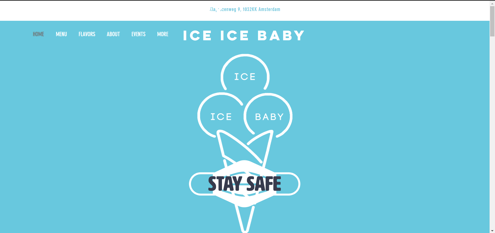

# Procesverslag
**Auteur:** Tensael Abebe

Markdown cheat cheet: [Hulp bij het schrijven van Markdown](https://github.com/adam-p/markdown-here/wiki/Markdown-Cheatsheet). Nb. de standaardstructuur en de spartaanse opmaak zijn helemaal prima. Het gaat om de inhoud van je procesverslag. Besteedt de tijd voor pracht en praal aan je website.

## Bronnenlijst
1. -bron 1-
2. -bron 2-
3. -...-

## Eindgesprek (week 7/8)

-dit ging goed & dit was lastig-

**Screenshot(s):**

-screenshot(s) van je eindresultaat-

## Voortgang 3 (week 6)

-same as voortgang 1-

## Voortgang 2 (week 5)

-same as voortgang 1-

## Voortgang 1 (week 3)

### Stand van zaken

Html was even wennen weer, het css gedeelte kwam veel terug in oefeningen.
Ook kwam ik er nog niet uit met het hamburger menu.

**Screenshot(s):**

https://gyazo.com/145e42f07fe46d21d117024108d1bab4

### Agenda voor meeting

Mehmet: 9:20-9:35
Roos: 9:35-9:50
Mila: 9:50-10:05
Tensael: 10:05-10:20
Tom: 10:20-10:25

### Verslag van meeting

-na afloop snel uitkomsten vastleggen-

## Intake (week 1)

**Je startniveau:** blauwe piste

**Je focus:** surface plane

**Je opdracht:** https://www.ice-ice-baby.nl/

**Screenshot(s):**

(images/flavors.PNG)

**Breakdown-schets(en):**

